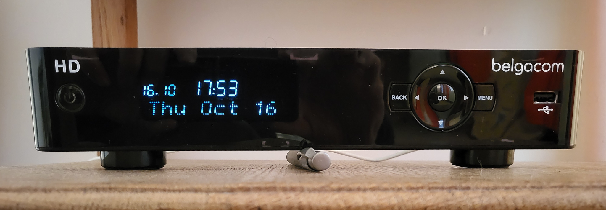
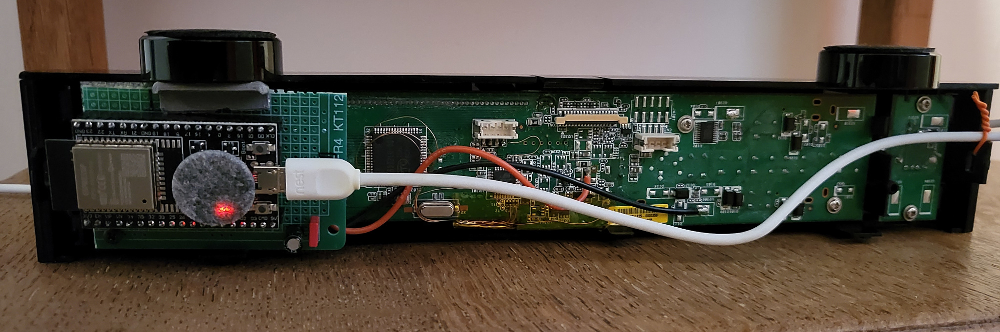
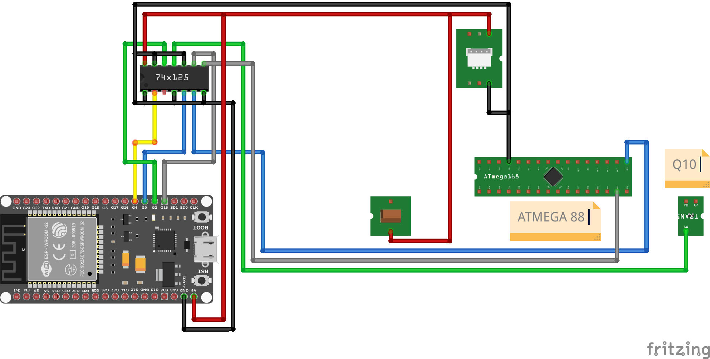
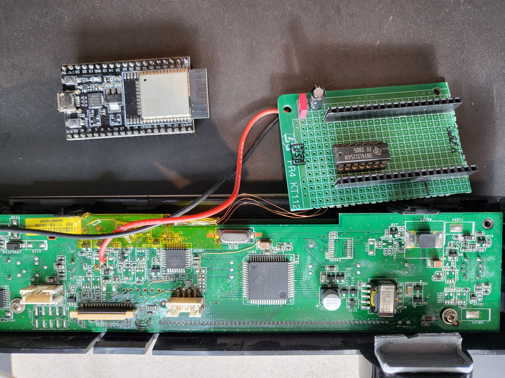
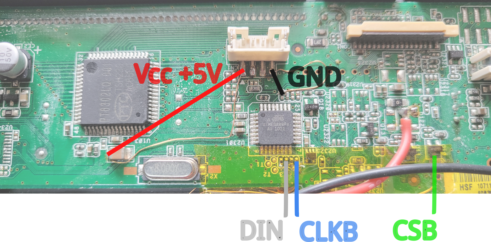
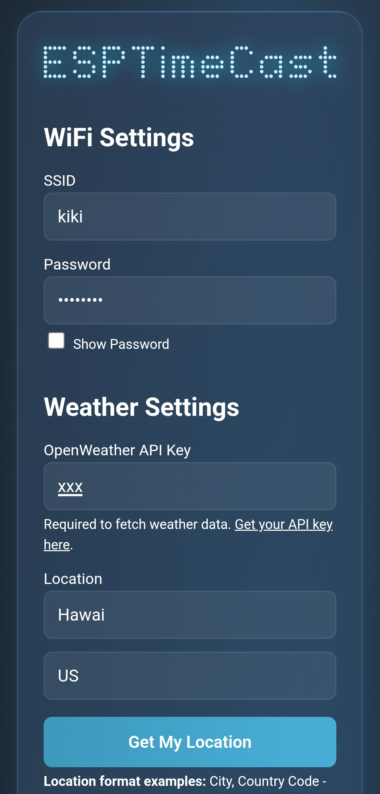
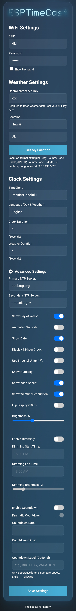

**ESPTimeCast** is featured on:

**ESPTimeCastVFD** is a WiFi-connected LED matrix clock and weather station based on ESP32 and PT6302 controler for VFD (Vacuum Fluorescent Display).
It displays the current time, day of the week, and local weather (temp/humidity/wind/weather description) fetched from OpenWeatherMap.  
Setup and configuration are fully managed via a built-in web interface.  

The VFD display is from a Belgacom (ISP in Belgium) TV Box v4, which is now obsolete but it features an interesting front panel and display.

The VFD display has various icons, 2 7-segments digits for date and time and 12 alphanumeric characters for the display of date, weather etc.

There is code available to test all the segments on the VFD.

Video:

## Mentions

ESPTimeCastVFD is a fork from [ESPTimeCast](https://github.com/mfactory-osaka/ESPTimeCast), with the following changes:
- Conversion to VSCode and PlatformIO,
- ESP32 code only. It is easy enough to configure a different board from PlatformIO,
- Board in use is ESP32 WROOM-32,
- use the VFD display with scrolling,
- add wind data from weather,
- minor corrections in the UI for timings, scrolling etc.

PT6302 driver code is from https://github.com/the-real-mcarn/PT6302, with changes for scrolling etc.

## ✨ Features

- **Belgacom TV Box v4 VFD** powered by PT6302, with integrated font
- **Simple Web Interface** for all configuration (WiFi, weather, time zone, display durations, and more)
- **Automatic NTP Sync** with robust status feedback and retries
- **Weather Fetching** from OpenWeatherMap (every 5 minutes, temp/humidity/wind/description)
- **Fallback AP Mode** for easy first-time setup or configuration
- **Timezone Selection** from IANA names (DST integrated on backend)
- **Get My Location** button to get your approximate Lat/Long.
- **Week Day and Weather Description display** in multiple languages
- **Persistent Config** stored in LittleFS, with backup/restore system
- **Status Animations** for WiFi connection, AP mode, time syncing.
- **Advanced Settings** panel with:
  - Custom **Primary/Secondary NTP server** input
  - Display **Day of the Week** toggle (default is on)
  - Display **Blinking Colon** toggle (default is on)
  - Show **Date** toggle (default is off)
  - **24/12h clock mode** toggle (24-hour default)
  - **Imperial Units (°F)** toggle (metric °C defaults)
  - Show **Humidity** toggle (display Humidity besides Temperature)
  - Show **Wind** toggle (display wind speed and gust besides Temperature)
  - **Weather description** toggle (displays: heavy rain, scattered clouds, thunderstorm etc.)
  - Adjustable display **brightness**
  - Dimming Hours **Scheduling**
  - **Countdown** function (Scroll / Dramatic)
  - Optional **glucose + trend** display (Nightscout-compatible, set via ntpserver2)
    
---

## 🪛 Wiring

The orignal front panel and VFD display is modified to be powered and controled from the ESP32.

Changes required:
- **Power** +5V and GND to the panel, plus wiring,
- Keep the original controler (ATMEGA88) in **reset** (GND on pin 29 RSTB),
- Connect the **SPI lines**,
- A 74LS125N (from 1978, S'il vous plait!) is used as a level shifter 3.3V → 5V.

**Wiring: WROOM32 (38 pins) → 74LS125 → panel PT6302**

| Name | Wroom-32 | 74LS125N | Panel |
|:------:|:------:|:------:|:------:|
| CLKB | 0 | 5 → 6 | ATMEGA 17, PT6302 54 |
| RSTB | 4 | 2 → X | ATMEGA 29 = GND, PT6302 48 has its own RC reset |
| CSB | 2 | 12 → 11 | Q10 C, PT6302 53 |
| DIN | 15 | 9 → 8 | ATMEGA 15, PT6302 55 |
| 5V | 5V | 14 | Connector+, C+ |
| GND | GND | 7 | Connector- |

Schematics:

Full view of the connections:

Detailed view on the connections:

---

## 🌐 Web UI & Configuration

The built-in web interface provides full configuration for:

- **WiFi settings** (SSID & Password)
- **Weather settings** (OpenWeatherMap API key, City, Country, Coordinates)
- **Time zone** (will auto-populate if TZ is found)
- **Day of the Week and Weather Description** languages
- **Display durations** for clock and weather (milliseconds)
- **Advanced Settings** (see below)

### First-time Setup / AP Mode

1. Power on the device. If WiFi fails, it auto-starts in AP mode:
   - **SSID:** `ESPTimeCast`
   - **Password:** `12345678`
   - Open `http://192.168.4.1` or `http://setup.esp` in your browser.
2. Set your WiFi and all other options.
3. Click **Save Setting** – the device saves config, reboots, and connects.
4. The device shows its local IP address after boot so you can login again for setting changes

*External links and the "Get My Location" button require internet access.  
They won't work while the device is in AP Mode - connect to Wi-Fi first.

### UI Examples:

---

## ⚙️ Advanced Settings

Click the **cog icon** next to “Advanced Settings” in the web UI to reveal extra configuration options.  

**Available advanced settings:**

- **Primary NTP Server**: Override the default NTP server (e.g. `pool.ntp.org`)
- **Secondary NTP Server**: Fallback NTP server (e.g. `time.nist.gov`)
- **Day of the Week**: Display Day of the Week in the desired language
- **Blinking Colon** toggle (default is on)
- **Show Date** (default is off, duration is the same as weather duration)
- **24/12h Clock**: Switch between 24-hour and 12-hour time formats (24-hour default)
- **Imperial Units (°F)** toggle (metric °C defaults)
- **Humidity**: Display Humidity besides Temperature
- **Wind**: Display Wind besides Temperature
- **Weather description** toggle (display weather description in the selected language* for 3 seconds or scrolls once if description is too long)
- **Flip Display**: Invert the display vertically/horizontally - No effect on VFD
- **Brightness**: Off - 0 (dim) to 15 (bright)
- **Dimming Feature**: Start time, end time and desired brightness selection
- **Countdown** function, set a countdown to your favorit/next event, 2 modes: Scroll/Dramatic! 

*Non-English characters converted to their closest English alphabet.   
*For Esperanto, Irish, and Swahili, weather description translations are not available. Japanese translations exist, but since the device cannot display all Japanese characters, English will be used in all these cases.  

Tip: Don't forget to press the save button to keep your settings

---

## 📝 Configuration Notes

- **OpenWeatherMap API Key:**
   - [Make an account here](https://home.openweathermap.org/users/sign_up)
   - [Check your API key here](https://home.openweathermap.org/api_keys)
- **City Name:** e.g. `Tokyo`, `London`, etc.
- **Country Code:** 2-letter code (e.g., `JP`, `GB`)
- **ZIP Code:** Enter your ZIP code in the city field and US in the country field (US only)
- **Latitude and Longitude** You can enter coordinates in the city field (lat.) and country field (long.)
- **Time Zone:** Select from IANA zones (e.g., `America/New_York`, handles DST automatically)

---

## 🚀 Getting Started

This guide will walk you through setting up your environment and uploading the **ESPTimeCast** project to your **ESP32** board. Please follow the instructions carefully for your specific board type.

---

### ⚙️ ESP32 Setup

The project is fully configured and ready to use.

In case of a specific board and settings, follow these steps.

1.  **Install ESP32 Board Package:**
    * Go to `PlatformIO > Board Explorer`. Search for `esp32` by `Espressif Systems`, select 'uPesy ESP32 Wroom DevKit' and click "Install".
2.  **Select Your Board:**
    * Go to `PlartformIO > Projects`, select your project and select your specific board, e.g., **upesy_wroom** (or your ESP32 variant).
3.  **Configure Partition Scheme:**
    * The LittleFS configuration to use is defined in `platformio.ini`.
4.  **Install Libraries:**
    * Go to `PlartformIO > Projects`, select your project and install the following under `Library Options`:
        * `ArduinoJson` by Benoit Blanchon
        * `ESPAsyncWebServer` by ESP32Async

---

### ⬆️ Uploading the Code and Data

Once your Arduino IDE is set up for your board (as described above):

1.  **Open the Project workspace**
    * Navigate to and open `esp32_wroom_vfd_clock.code-workspace`, which opens the VSCode project.
2.  **Compile and Upload the formware**
    * Click 'PlatformIO: Upload'. This will compile the entire project and upload it to your board.
3.  **Upload `/data` folder (LittleFS):**
    * This project uses LittleFS for storing web interface files and other assets.
    * In `PlatformIO`, click `Upload Filesystem Image`. This generates and uploads the FS to the board.

---

## 📺 Display Behavior

**ESPTimeCast** automatically switches between two display modes: Clock and Weather.
If "Show Weather Description" is enabled a third mode (Description) will display with a duration of 3 seconds, if the description is too long to fit on the display the description will scroll from right to left once.

What you see on the LED matrix depends on whether the device has successfully fetched the current time (via NTP) and weather (via OpenWeatherMap).  
The following table summarizes what will appear on the display in each scenario:

| Display Mode | 🕒 NTP Time | 🌦️ Weather Data | 📺 Display Output                              |
|:------------:|:----------:|:--------------:|:--------------------------------------------|
| **Clock**    | ✅ Yes      | —              | 🗓️ Day Icon + ⏰ Time (e.g. `@ 14:53`)           |
| **Clock**    | ❌ No       | —              |  `! NTP` (NTP sync failed)               |
| **Weather**  | —          | ✅ Yes         | 🌡️ Temperature (e.g. `23ºC`)                |
| **Weather**  | ✅ Yes      | ❌ No          | 🗓️ Day Icon + ⏰ Time (e.g. `@ 14:53`)           |
| **Weather**  | ❌ No       | ❌ No          |  `! TEMP` (no weather or time data)       |

### **How it works:**

- The display automatically alternates between **Clock** and **Weather** modes (the duration for each is configurable).
- If "Show Weather Description" is enabled a third mode **Description** will display after the **Weather** display with a duration of 3 seconds.
- In **Clock** mode, if NTP time is available, you’ll see the current time plus a unique day-of-week icon. If NTP is not available, you'll see `! NTP`.
- In **Weather** mode, if weather is available, you’ll see the temperature (like `23ºC`). If weather is not available but time is, it falls back to showing the clock. If neither is available, you’ll see `! TEMP`.
- All status/error messages (`! NTP`, `! TEMP`) are big icons shown on the display.

**Legend:**
- 🗓️ **Day Icon**: Custom symbol for day of week (`@`, `=`, etc.)
- ⏰ **Time**: Current time (HH:MM)
- 🌡️ **Temperature**: Weather from OpenWeatherMap
- ✅ **Yes**: Data available
- ❌ **No**: Data not available
- — : Value does not affect this mode

---

## ☕ Development work

- Linux porting, device drivers and firmware by [**NewOldBits.com**](https://www.newoldbits.com)

